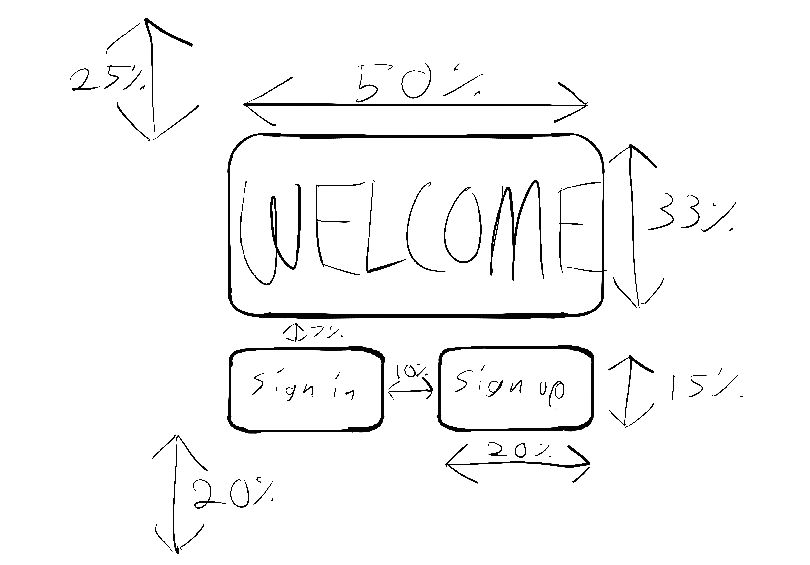
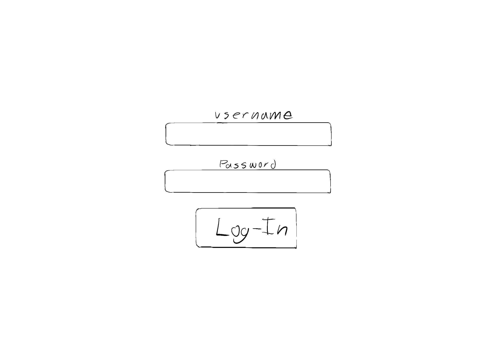
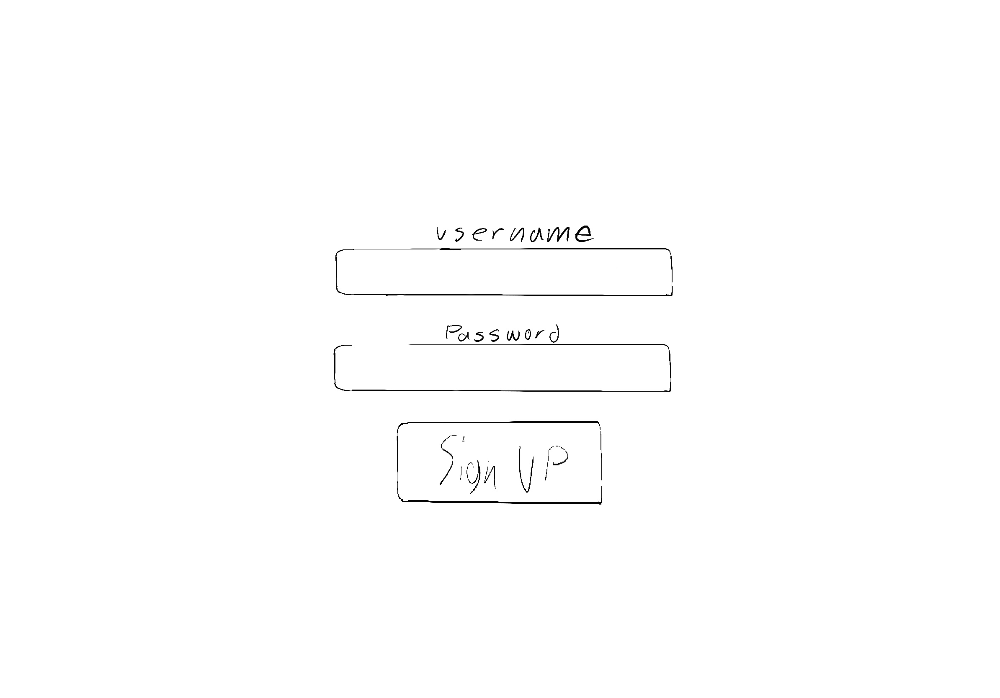
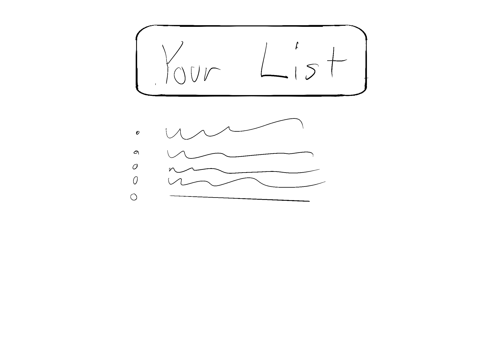
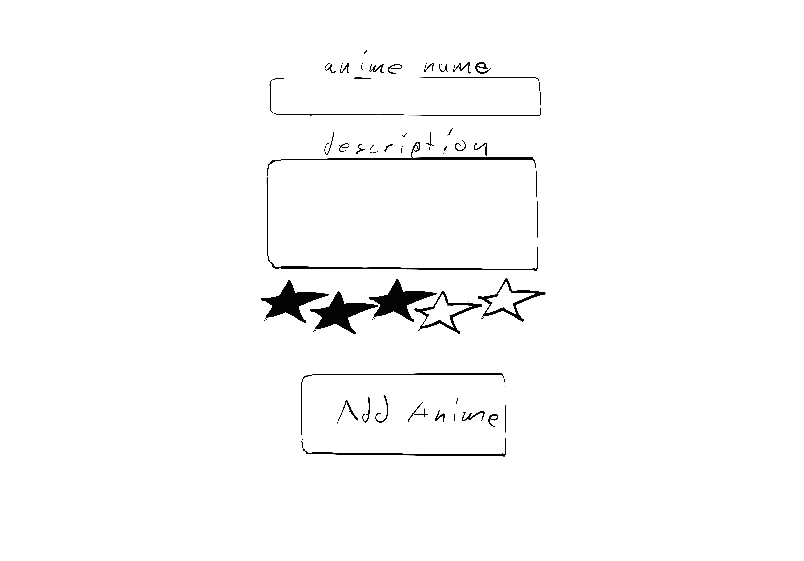

# anime list
## an app to store all your favorite animes

AAU i should be able to log into my individual account so that i can see my personal anime list

AAU i should be able to add a anime to my anime list complete with name and rating 

AAU i should be able to delete an anime from the list 

AAU i should be able to edit an anime on the anime list so if i make a spelling 
mistake or want to re rate the anime i can

AAU i should be able to show my full list of animes 

| HTTP method |   | path/endpoint/uri    |   | crud operation |   | has data payload? |   | purpose                                               |   | render/redirect Action                                                                                             |
|-------------|---|----------------------|---|----------------|---|-------------------|---|-------------------------------------------------------|---|--------------------------------------------------------------------------------------------------------------------|
| GET         |   | '/'                  |   | Read           |   | no                |   | the page you land on when you go to the root          |   | sign-up/sign-in button                                                                                             |
| GET         |   | '/auth/users/signup' |   | Read           |   | no                |   | the sign up page                                      |   | sign up button redirects to PUT auth/users/signup                                                                  |
| POST        |   | '/auth/users/signup' |   | Create         |   | yes               |   | the info when user fills in                           |   | redirects to animes list                                                                                           |
| GET         |   | '/auth/users/login   |   | Read           |   | no                |   | the user log in page                                  |   | input button redirects to PUT auth/users/login                                                                     |
| POST        |   | '/auth/users/login'  |   | Create         |   | yes               |   | the info when user fills in log in form               |   | redirect to anime list                                                                                             |
| GET         |   | '/animes'            |   | Read           |   | no                |   | shows your full list of anime                         |   | each anime is clickable to redirect to their page and an add anime button that redirects to the create anime path  |
| GET         |   | '/animes/create'     |   | Read           |   | no                |   | shows the create new anime form                       |   | input redirects to POST '/animes/create'                                                                           |
| POST        |   | '/animes/create'     |   | Create         |   | yes               |   | adds a new anime to the db                            |   | redirects to '/animes'                                                                                             |
| GET         |   | '/animes/:id'        |   | Read           |   | no                |   | shows the anime you clicked on                        |   | delete and edit buttons redirect to corrasponding pages                                                            |
| GET         |   | '/animes/:id/edit'   |   | Read           |   | no                |   | shows the specific anime with prefilled form fields   |   | redirects to PUT '/animes/:id/edit'                                                                                |
| PUT         |   | '/animes/:id/edit'   |   | Update         |   | yes               |   | puts the info user inputed to the edit form to the db |   | redirects to edited anime display page                                                                             |
| DELETE      |   | 'animes/:id/delete'  |   | Delete         |   | yes               |   | deletes the selected anime                            |   | redirects to the full animes list                                                                                  |

# timeline
| day       | goal                                   |
|-----------|----------------------------------------|
| monday    | finish labs                            |
| tuesday   | proposal                               |
| wednesday | setup make auth sign in functionality  |
| thursday  | finish the rest of the logic and ejs   |
| friday    | css styling                            |

